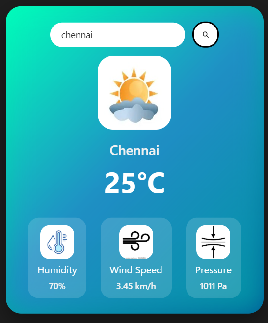

# 🌦️ Weather App

A clean and responsive **Weather Web Application** that fetches real-time weather data using an external weather API and displays it in a user-friendly interface.

---

## 🚀 Live Demo
https://guravanakrishna111-tech.github.io/Weather-app/
## 📌 Features

* 🌍 Search weather by city name
* 🌡️ Displays temperature, weather condition, and details
* 🖼️ Dynamic weather icons
* ⚡ Fast API data fetching
* 📱 Responsive design for all screen sizes

---

## 🛠️ Tech Stack

* **HTML5** – Structure
* **CSS3** – Styling & Layout
* **JavaScript (Vanilla)** – Logic & API integration
* **Weather API** – Real-time data

---

## 📂 Project Structure

```
Weather-App/
│
├── index.html
├── style.css
├── script.js
└── images/
```

---

## 🔑 API Setup

This project uses a weather API.

To run locally:

1. Get your API key from a weather API provider
2. Open `script.js`
3. Replace:

```js
const API_KEY = "YOUR_API_KEY";
```

with your actual key.

---

## ▶️ How to Run Locally

1. Download or clone the repository
2. Open project folder
3. Double-click `index.html`

OR run using Live Server in VS Code.

---

## 📸 Screenshot


## 📈 Future Improvements

* Add geolocation weather detection
* Add 5-day forecast
* Add dark/light mode toggle
* Improve UI animations

---

## 🤝 Contributing

Contributions are welcome. Feel free to fork this repo and submit a pull request.

---

## 📜 License

This project is open-source and free to use.

---

## 👨‍💻 Author

**Krishna**
Computer Science Undergraduate
Aspiring Software Developer